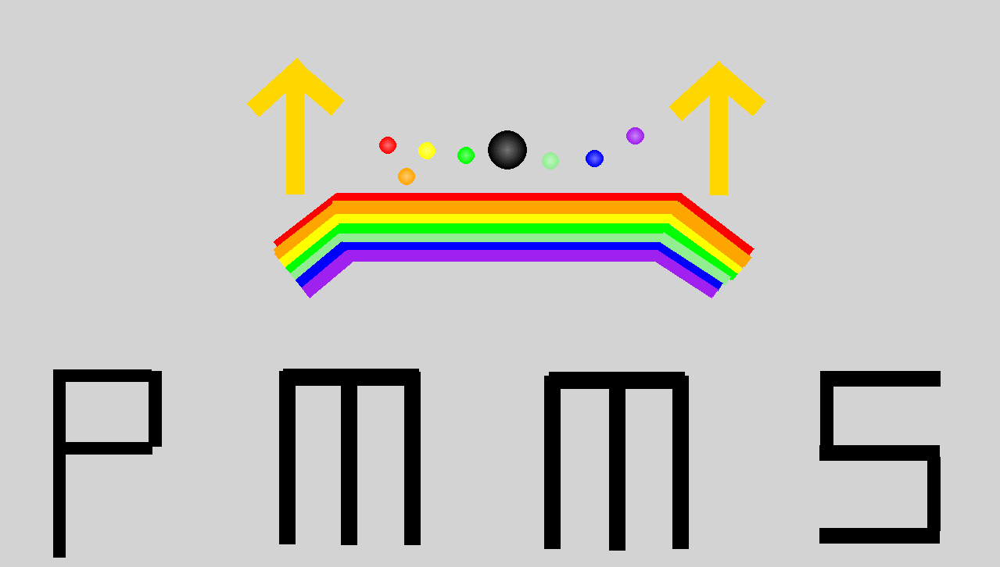

# PMSS-Pro 物理运动模拟系统



一个专为物理教学设计的数字实验平台，支持从微观粒子到天体运动的全方位物理现象模拟。通过直观的交互界面和参数调节功能，帮助师生轻松验证物理理论，提升教学趣味性。

本系统基于Python和Pygame开发，采用自研物理引擎，实现了高精度的物理模拟计算，包括碰撞检测、弹性碰撞、引力模拟等功能。同时集成了AI助手，支持通过自然语言创建和控制物理场景。
  
[](https://github.com/STAR-0501/PMSS-Pro/releases/latest) [](https://pmss.starbot.top/help/) [](https://starbot.top)

## 🌟 核心功能

- **多场景模拟**  
  支持地表模式与天体模式一键切换，自由模拟真空环境、火星重力等特殊场景。
- **参数自由调节**  
  实时调整重力、空气阻力、碰撞系数等参数，创造理想实验条件。
- **智能交互设计**  
  - 拖拽放置物体，滑动设置初速度  
  - 右键菜单快速编辑属性，中键复制物体  
  - 预设模板一键加载（数字键0-9快速调用）
  - 接入AI助手，可通过自然语言描述完成指令
- **天体模式特色**  
  - 天体间引力计算与融合效果  
  - Ctrl键自动生成环绕轨道  
  - 支持构建太阳系级比例模型
- **教学辅助工具**  
  - 实时显示速度/加速度数据  
  - 倍速播放与视角跟随  
  - 内置多种中学物理实验模板
- **物理引擎特性**  
  - 精确的碰撞检测与响应系统
  - 保持碰撞前后速度大小不变的物理模型
  - 多步物理模拟，提高计算精度
  - 支持弹簧、杆、绳索等复杂物理元素

## 🛠️ 安装与运行

### 环境要求
- 操作系统：Windows 10/11 64位
- Python 3.12.9
- 依赖库：Pygame 2.6.1, OpenAI API（用于AI助手功能）

### 快速启动
```bash
git clone https://github.com/STAR-0501/PMSS-Pro.git
cd PMSS-Pro
pip install -r requirements.txt
python main.py
```

### 配置AI助手（可选）
如需使用AI助手功能，请在`config/siliconFlowConfig.json`中配置您的API密钥。系统默认使用DeepSeek模型，您也可以在配置文件中更改为其他支持的模型。
## 🕹️ 基础操作指南

### 常用快捷键
| 按键             | 功能                  |
| ---------------- | --------------------- |
| W/A/S/D          | 移动摄像机            |
| 鼠标拖动左键     | 拖动物体/摄像机       |
| 鼠标中键点击物体 | 复制物体              |
| P                | 切换天体模式          |
| M                | 打开环境设置面板      |
| G/L/K            | 存档管理（保存/加载） |
| ←/→              | 调节模拟速度          |
| 空格             | 暂停/继续模拟         |

### 三步创建实验
1. **放置物体**：从右侧菜单选择物体，点击场景放置
2. **设置属性**：右键物体调整质量/颜色，拖动设置初速度
3. **观察现象**：按空格键开始模拟，实时数据自动显示

## 📚 进阶功能

### 天体系统搭建
- 按P进入天体模式
- 按住Ctrl放置物体自动生成环绕轨道
- 调整质量参数模拟行星运动

### 理想实验环境
- 按M打开环境设置
- 将空气阻力设为1实现真空环境
- 重力设为0模拟太空失重
- 调整碰撞系数实现不同弹性碰撞效果

## 🏆 项目亮点

- **自研物理引擎**：
  - 像素级碰撞检测算法，支持毫秒级运动计算
  - 精确的碰撞响应系统，保持碰撞前后速度大小不变
  - 多步物理模拟，提高计算精度
  - 支持复杂物理元素（弹簧、杆、绳索）的模拟

- **AI教学助手**：
  - 集成DeepSeek模型，通过自然语言描述完成指令
  - 支持20多种物理场景控制命令
  - 可通过自然语言创建和调整物理元素
  - 支持保存和加载实验场景

- **教育实践验证**：
  - 已在实际课堂应用，显著提升教学效率
  - 支持多种中学物理实验模拟
  - 直观展示物理规律，增强学生理解

## 📜 许可与声明

本项目代码采用GNU Lesser General Public License v2.1许可证开源，部分素材来源于网络，仅供学习交流使用。

## 🔧 技术架构

- **前端**：Pygame实现的交互式图形界面
- **物理引擎**：自研的物理计算模块，包含碰撞检测、运动学计算等
- **AI模块**：基于OpenAI API，支持自然语言控制
- **配置系统**：JSON格式的配置文件，支持自定义环境参数

## 📄 项目根目录文件

项目根目录下包含以下重要文件：

- `main.py`: 程序主入口文件，负责启动整个物理模拟系统
- `requirements.txt`: 项目依赖库列表，包含pygame和openai两个主要依赖
- `LICENSE.md`: GNU Lesser General Public License v2.1许可证文件，规定了本项目的开源许可条款
- `count_code_stat.py`: 代码统计工具，用于分析项目中各类型文件的行数和大小，支持按文件路径和文件类型统计
- `format.bat`: 代码格式化批处理脚本，使用autopep8工具自动格式化项目中的所有Python文件

## ⚙️ 配置文件说明

项目配置文件位于`config`目录下，包含以下文件：

- `elementOptions.json`: 定义物理元素（如球体、墙体等）的属性和控制选项，包括质量、半径、颜色等参数范围和默认值
- `environmentOptions.json`: 定义环境参数设置，包括重力、空气阻力、碰撞系数和模式（地表/天体）的取值范围和默认值
- `modelList.json`: AI助手可用的模型列表，包含多种DeepSeek、Qwen等大语言模型
- `screenSize.txt`: 存储屏幕大小设置，用于程序启动时初始化窗口尺寸
- `siliconFlowConfig.json`: AI助手配置文件，包含API密钥和默认使用的模型设置
- `translation.json`: 界面元素的中英文翻译映射，用于程序的多语言支持

## 📁 源码结构

项目源码位于`source`目录下，分为四个主要模块：

### 基础物理模块 (source/basic/)

- `ball.py`: 球体物理实体类，处理运动学计算和碰撞响应
- `collision_line.py`: 碰撞线段类，用于线段碰撞检测
- `color.py`: 颜色处理工具类，提供颜色混合等功能
- `coordinator.py`: 坐标系转换工具，处理屏幕坐标与物理坐标的转换
- `element.py`: 物理元素基类，定义所有物理对象的共同属性和方法
- `rod.py`: 轻杆类，处理轻杆的显示和物理效果
- `rope.py`: 绳索类，模拟柔性连接的物理效果
- `spring.py`: 弹簧类，模拟弹簧的物理特性和视觉效果
- `vector2.py`: 二维向量类，提供向量运算支持
- `wall.py`: 墙体类，处理墙体的显示和碰撞
- `wall_position.py`: 墙体位置类，用于固定点的位置定义

### 核心控制模块 (source/core/)

- `__main__.py`: 程序入口，初始化游戏并启动AI线程
- `ai_thread_loop.py`: AI线程循环，处理AI助手的后台运行
- `command.py`: 命令解析器，处理AI助手和用户输入的命令

### 游戏界面模块 (source/game/)

- `game.py`: 游戏主类，管理游戏状态和更新循环
- `element_controller.py`: 元素控制器，处理物理元素的创建和管理
- `input_menu.py`: 输入菜单，处理用户文本输入
- `menu.py`: 菜单系统，提供界面交互元素
- `control_option.py`: 控制选项类，定义物体右键菜单选项
- `input_box.py`: 输入框类，处理文本输入
- `option.py`: 选项类，处理环境参数设置
- `set_caps_lock.py`: 大写锁定设置，辅助键盘输入
- `settings_button.py`: 设置按钮类，提供界面交互元素

### AI助手模块 (source/ai/)

- `ai.py`: AI类，与用户进行对话并执行相应命令

## 🖼️ 静态资源文件

项目静态资源文件位于`static`目录下，包含以下文件：

- `HarmonyOS_Sans_SC_Medium.ttf`: 华为鸿蒙字体，用于系统界面文字显示
- `basketball.png`: 篮球模拟实验预设图标
- `cover.png`: 软件界面封面图，用于README展示
- `easterEgg.png`: 彩蛋图片，在特定操作时显示
- `flatToss.png`: 平抛运动实验预设图标
- `freeFall.png`: 自由落体实验预设图标
- `idealBevel.png`: 理想斜面实验预设图标
- `python.ico`: 程序窗口图标（ICO格式）
- `python.png`: 程序窗口图标（PNG格式）
- `settings.png`: 设置按钮图标
- `simplePendulum.png`: 单摆实验预设图标
- `solarSystem.png`: 太阳系模拟预设图标
- `uniformCircularMotion.png`: 匀速圆周运动实验预设图标

## 🌌 探索物理世界

从伽利略的自由落体到开普勒的行星运动，从简谐振动到弹性碰撞，让每个物理猜想都能在PMSS-Pro中得到验证！

如有问题请联系：riyi@starbot.top

---